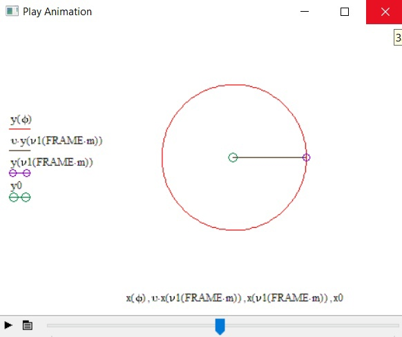

# Kepler-s_laws-mathcad-

**Первый закон Кеплера:** Орбита КО имеет эллиптическую форму с Солнцем в качестве одного из фокусов. 
**Второй закон Кеплера:** Каждая планета движется в плоскости, проходящей через центр Солнца, причём за равные промежутки времени радиус-вектор, соединяющий Солнце и планету, описывает собой равные площади. 
**r** - расстояние от КО до солнца 
**ϕ** - угол, на который повернут КО 
**ecc** - эксцентриситет орбиты(эллипса) 
**p**-перпендикуляр от фокуса до кривой 
**K** - Гауссовская гравитационная постоянная для солнца 
****a - большая полуось эллипса 
**T** - период вращения КО 
**ν1** - истинная аномалия (угол между направлениями на перигей и на КО, отсчитываемый в сторону движения КО) 
**m** - масса 

Реализованы 3 закона Кеплера:

 

Реализовано движение планеты по орбите, а также ее спутника с отрисовкой полосы анимации и траектории движения

 

