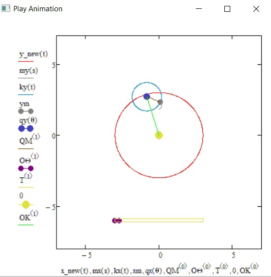

# Kepler-s_laws-mathcad-

**Первый закон Кеплера:** Орбита КО имеет эллиптическую форму с Солнцем в качестве одного из фокусов.
**Второй закон Кеплера:** Каждая планета движется в плоскости, проходящей через центр Солнца, причём за равные промежутки времени радиус-вектор, соединяющий Солнце и планету, описывает собой равные площади.
**r** - расстояние от КО до солнца
**ϕ** - угол, на который повернут КО
**ecc** - эксцентриситет орбиты(эллипса)
**p**-перпендикуляр от фокуса до кривой
**K** - Гауссовская гравитационная постоянная для солнца
****a - большая полуось эллипса
**T** - период вращения КО
**ν1** - истинная аномалия (угол между направлениями на перигей и на КО, отсчитываемый в сторону движения КО)
**m** - масса

Реализованы 3 закона Кеплера:

 

Реализовано движение планеты по орбите, а также ее спутника с отрисовкой полосы анимации и траектории движения

 

